# FastAPI User Management API
This is a simple API built with FastAPI to manage user information. It provides endpoints to create, read, update, delete users, and find user matches based on specific criteria.

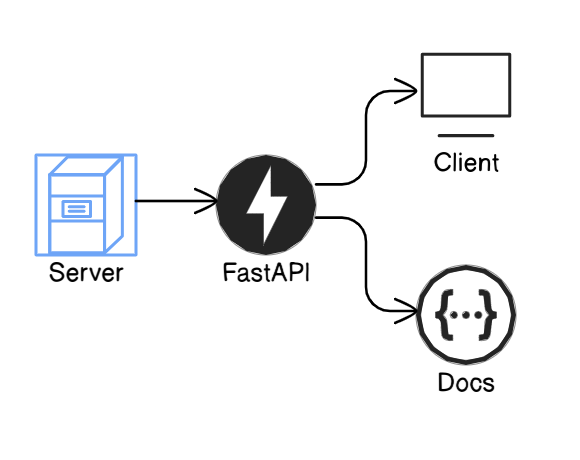

## Features
- User creation with email validation.
- Retrieve user information.
- Update and delete user details.
- Find user matches based on gender, city, and interests.

## Prerequisites
Before running this project, ensure you have the following installed:

- `Python 3.10+`
- `FastAPI`
- `SQLAlchemy`
- `Pydantic`
- `SQLite`

## Installation
#### Clone the repository:

```bash

git clone { URL }

```

#### Navigate to the project directory:

```bash

cd UrbanMatch-PythonTask

```

## File - Folder structure
The file folder structure is as follows
- UrbanMatch-PythonTask
  - **Public**: Folder for storing assets and media files
  - `databse.py`: File consisting of database configuration code
  - `main.py`: Main file for server and all controllers
  - `models.py`: File containing model for user
  - `schemas.py`: File containing schemas for a different controller with `SQLAlchemy`


## Install the dependencies:

##### Create a virtual environment for the packages and add that to the source

```bash
python -m venv venv
```

##### Add enviroment to your source
```bash
source venv/bin/activate
```
- For more : https://fastapi.tiangolo.com/virtual-environments/

##### Install all dependencies from txt file
``` bash

pip install -r requirements.txt

```
## Database Setup
The project uses `SQLAlchemy` for ORM and `SQLite` by default.
## SQLite Configuration
The app is pre-configured to use SQLite with the file test.db in the project directory. You must create a `test.db` file in your root repo.
- `UrbanMatch-PythonTask`
  - `test.bd`


The Entity-Relation diagram for user  :

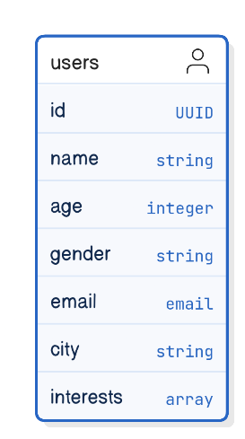

## Running the Application
To run the FastAPI app, Open the terminal and run the following command:

```bash

fastapi dev main.py

```
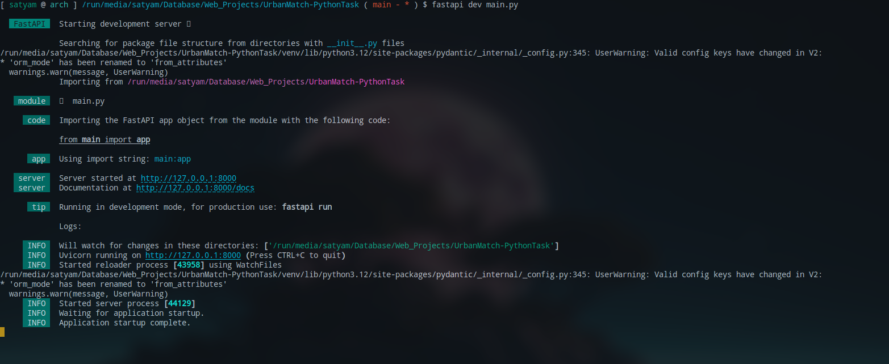

The application will start on `http://127.0.0.1:8000`.


## Access the API Documentation:

- Go to `http://127.0.0.1:8000/docs` for interactive Swagger UI.

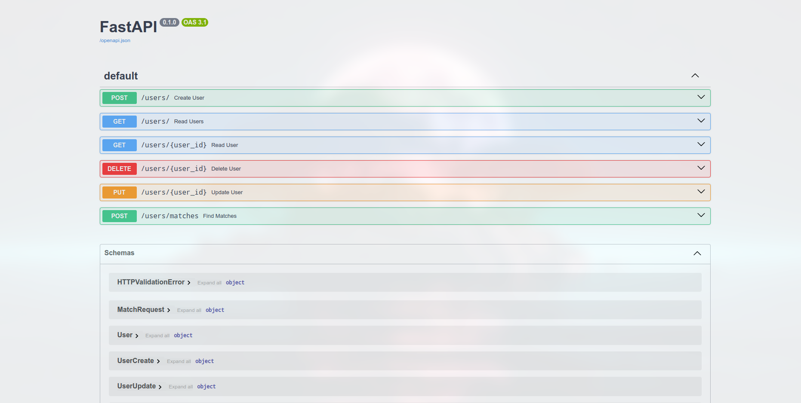

# Endpoints

#### 0. Server running response
- **URL**: `/`
- **Method**: `GET`
- **Body**:
```json
{
  "message": "Hello World"
}
```
- **Response**: Returns the response Hello world to confirm server status.


#### 1. Create a User
- **URL**: `/users/`
- **Method**: `POST`
- **Body**:
```json
{
  "name": "John Doe",
  "age": 30,
  "gender": "Male",
  "email": "johndoe@example.com",
  "city": "New York",
  "interests": ["coding", "reading"]
}
```
- **Response**: Returns the created user details.

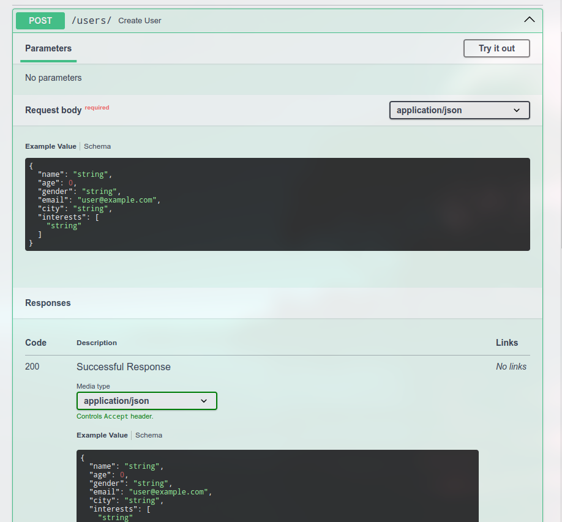

#### 2. Get All Users
- **URL**: `/users/`
- **Method**: `GET`
- **Query Parameters**:
  - `skip` (optional): Number of records to skip (default 0).
  - `limit `(optional): Limit the number of records returned (default 10).
- **Response**: List of users.

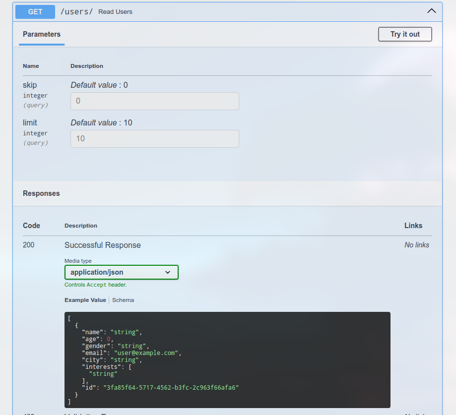

#### 3. Get a User by ID
- **URL**: /users/{user_id}
- **Method**: GET
- **Path Parameter**: user_id (UUID)
- **Response**: The user details.

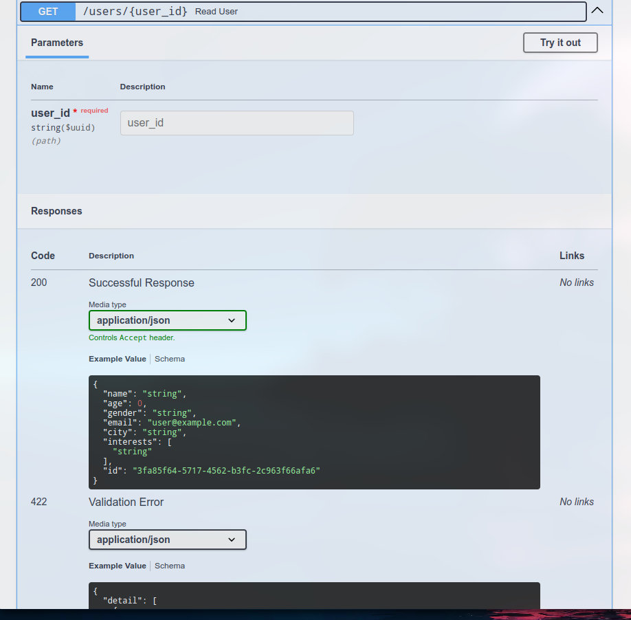

#### 4. Update a User
- **URL**: /users/{user_id}
- **Method**: PUT
- **Body**:
```json
{
  "name": "John Updated",
  "age": 31,
  "gender": "Male",
  "email": "johnupdated@example.com",
  "city": "Los Angeles",
  "interests": ["coding", "travelling"]
}
```
- **Response**: The updated user details.

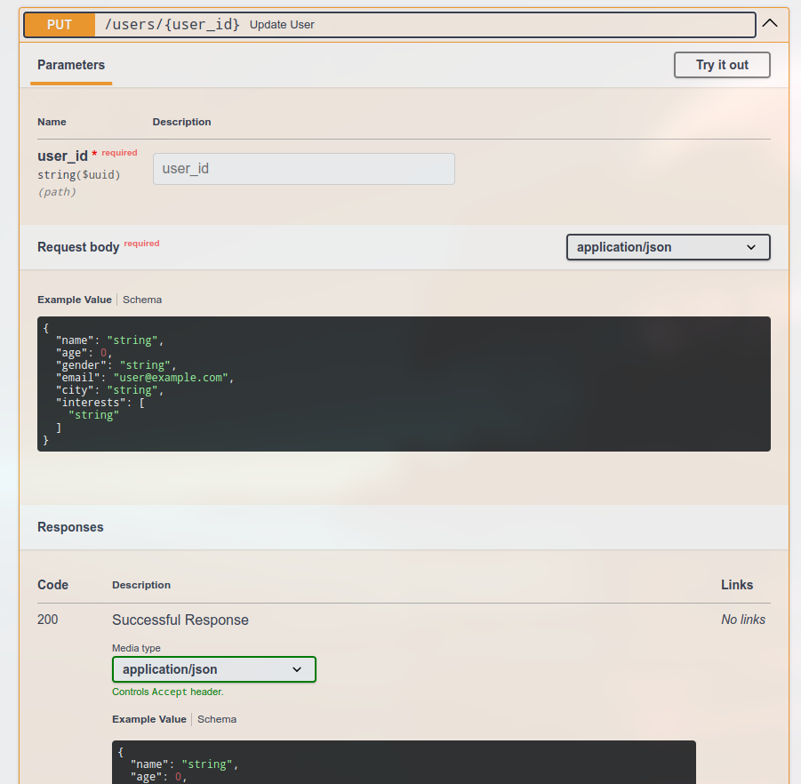

#### 5. Delete a User
- **URL**: /users/{user_id}
- **Method**: DELETE
- **Path Parameter**: user_id (UUID)
- **Response**: The deleted user details.

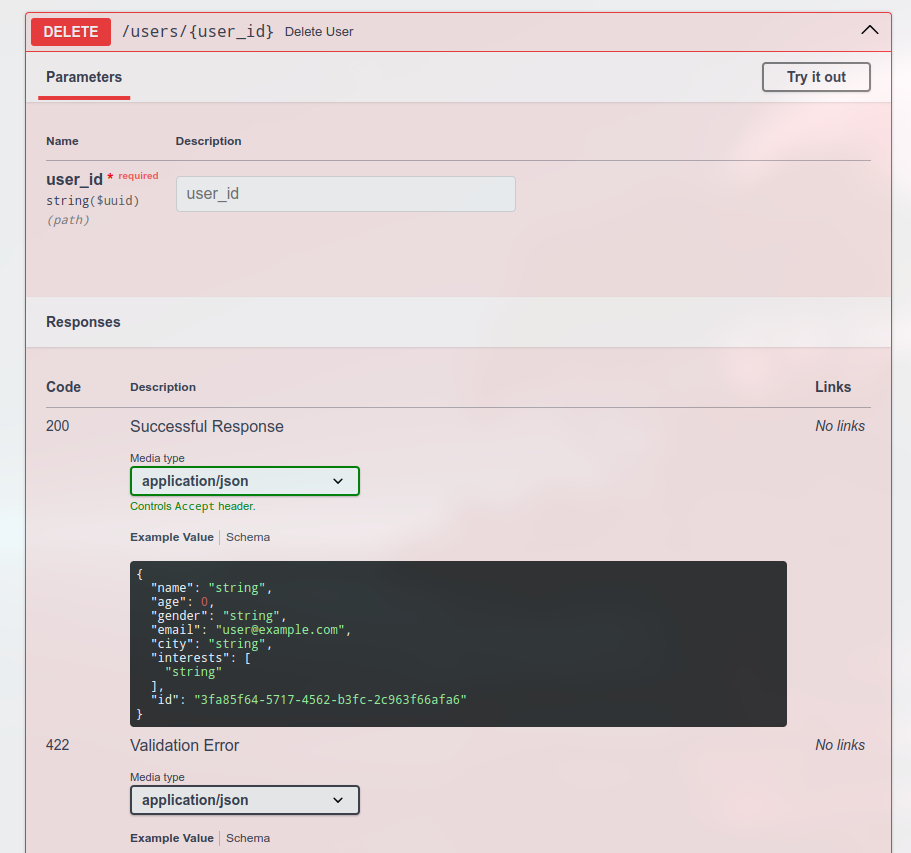

#### 6. Find User Matches
- **URL**: /users/matches
- **Method**: POST
- **Body**:
```json
{
  "gender": "Female",
  "city": "New York",
  "interests": ["reading"]
}
```
- **Response**: List of users matching the criteria.

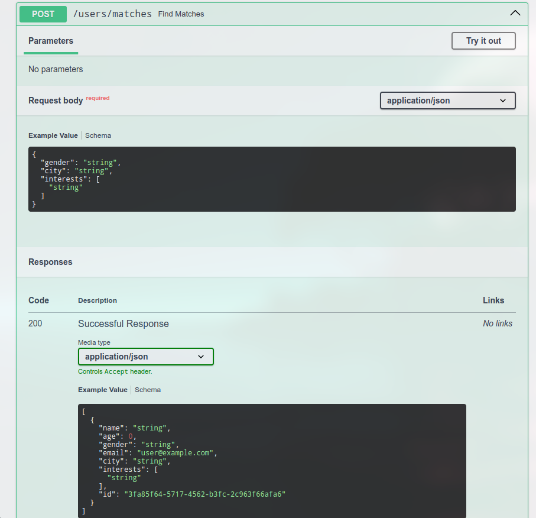

##### Flow Diagram for controllers are (Schemas diagram)
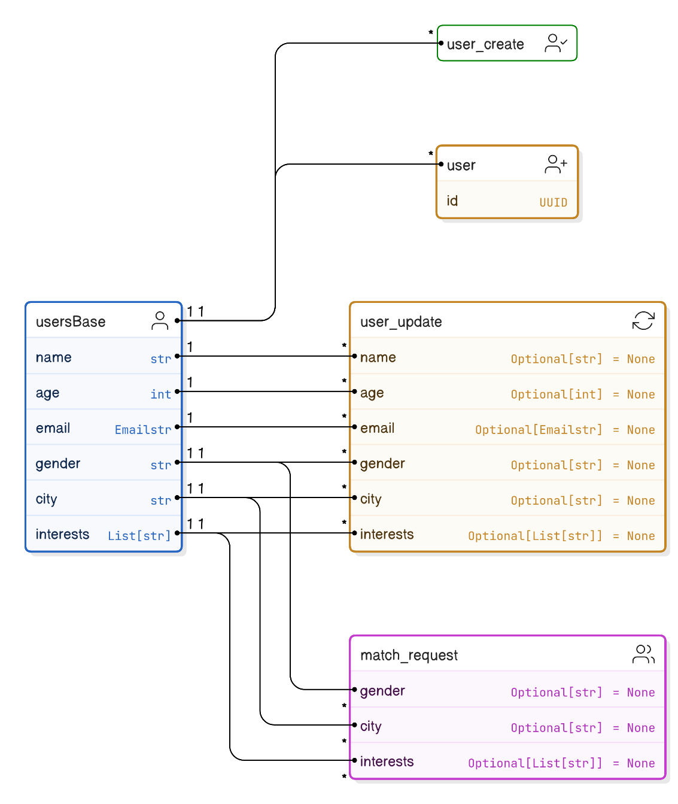

## Example Requests
### Create User
```bash
curl -X 'POST' \
  'http://127.0.0.1:8000/users/' \
  -H 'Content-Type: application/json' \
  -d '{
  "name": "Jane Doe",
  "age": 25,
  "gender": "Female",
  "email": "janedoe@example.com",
  "city": "Los Angeles",
  "interests": ["coding", "music"]
}'
```
### Get All Users
```bash
curl -X 'GET' \
  'http://127.0.0.1:8000/users/?skip=0&limit=5'
```
### Update User
```bash
curl -X 'PUT' \
  'http://127.0.0.1:8000/users/8c99c939-b6f5-4a50-90d7-e3bced8d2e2e' \
  -H 'Content-Type: application/json' \
  -d '{
  "name": "Jane Smith",
  "age": 26,
  "gender": "Female",
  "email": "janesmith@example.com",
  "city": "San Francisco",
  "interests": ["coding", "travelling"]
}'
```

# Conclusion
In this project, we developed a `FastAPI` application with `SQLAlchemy` to manage user data. The system supports CRUD operations (Create, Read, Update, Delete) and a matching feature to find users based on criteria like `gender`, `city`, and `interests`.

#### Key highlights:

- **Database Setup**: Integrated SQLAlchemy with SQLite.
- **User Management**: Implemented user CRUD operations.
- **Matching System**: Users can find others based on specific filters.
- **Validation & Error Handling**: Pydantic models were used for validation and proper error handling.
